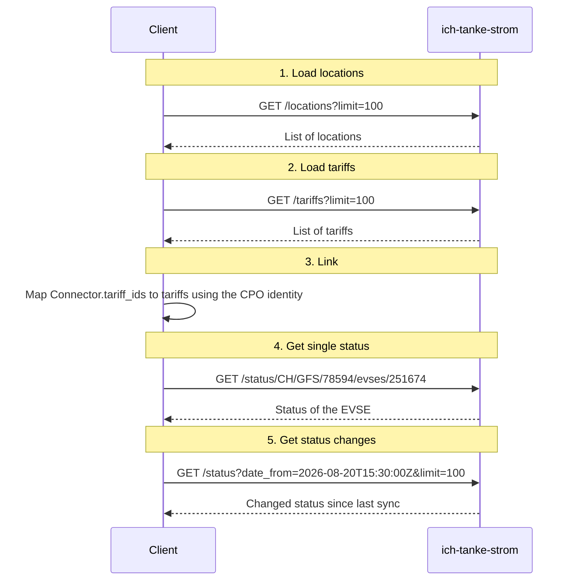

# How to query the ich-tanke-strom-API

ich-tanke-strom.ch is the central platform for collecting and providing information on charging infrastructure in Switzerland. The platform receives OCPI data from various Charge Point Operators (CPOs), in particular on locations with their EVSEs, on tariffs and on booking information.

The data is received by ich-tanke-strom.ch, aggregated, converted into the target format OCPI 2.3 and prepared for distribution. Charging point, tariff and booking information from different sources can therefore be queried and processed in a uniform structure.

The consolidated data is provided **read-only**. Data consumers can obtain it either via the interface described in this document (OCPI-based JSON) or as GeoJSON. Write access for external data consumers is not intended. Data ownership remains with the respective CPOs.

**Responsible**: Swiss Federal Office of Energy (SFOE), Mobility Section<br>
**Contact**: [ichtankestrom@bfe.ch](mailto:ichtankestrom@bfe.ch)

## General information

| Topic | Specification |
|---|---|
| API style | REST/JSON, OCPI-based |
| Role of the NAP (SFOE) | Aggregator and read-only sender |
| Modules | Locations, tariffs and current EVSE status |
| Access | Public, no authentication |
| Timestamps | ISO 8601 / UTC, e.g. `2026-08-20T10:15:30Z` |
| Character set | UTF-8 |
| Transport | HTTPS, TLS 1.2 or higher |

## Data flow


The interface provides the charging point and tariff data of various CPOs, aggregated by ich-tanke-strom.ch, read-only to external data consumers. Three APIs are available:

* Locations API
* Tariffs API
* EVSE Status API

**Important**: External data consumers cannot modify locations or tariffs. Data ownership remains with the respective CPO.

## Access

The interface is publicly accessible. No authentication and no `Authorization` header are required.

```
Accept: application/json
```

ich-tanke-strom.ch returns the following status codes:

| Situation | HTTP | OCPI status_code |
|---|---|---|
| Success | 200 | 1000 |
| Object not found | 404 | 2003 |
| Invalid parameter | 400 | 2001 |
| Internal error | 500 | 3000 |

## Conventions

### OCPI response wrapper

Every request returns a JSON object with the following fields:

| Field | Type | Required | Description |
|---|---|---|---|
| data | Object or array | Yes, on success | Payload |
| status_code | Integer | Yes | Four-digit OCPI status code |
| status_message | String | No | Additional information |
| timestamp | DateTime | Yes | Time of the response |

```json
{
  "data": [],
  "status_code": 1000,
  "status_message": "Success",
  "timestamp": "2026-08-20T10:15:30Z"
}
```

### Pagination

The number of objects returned can be set with the `limit` parameter. The default is 1000 objects.

| Parameter | Type | Default | Meaning |
|---|---|---|---|
| limit | Integer | 1000 | Maximum number of objects returned |

### Origin and uniqueness

Since ich-tanke-strom.ch aggregates data from several CPOs, an ID alone is not globally unique. An object is therefore identified by `country_code` + `party_id` + `id`. These values come from the original CPO data record and are not changed.

## Locations API

A location describes a physical charging site with one or more charging stations (EVSEs), each of which has one or more connectors. The endpoint returns complete location objects including EVSEs and connectors.

### Endpoints

| Method | Path | Description |
|---|---|---|
| GET | `/locations` | List of all visible locations |
| GET | `/locations/{country_code}/{party_id}/{location_id}` | Single location of a CPO |

### Get list

Request:

```
GET /locations?limit=100
```

Response:

* **Success**: HTTP 200. The field `data` contains an array of location objects.
* **No results**: HTTP 200. An empty array is returned.
* **Error**: HTTP 40x (see [Error examples](#error-examples)).
* **Server error**: HTTP 500.

Example:

```json
{
  "status_code": 1000,
  "status_message": "Success",
  "timestamp": "2026-09-11T08:30:00Z",
  "data": [
    {
      "country_code": "CH",
      "party_id": "GFS",
      "id": "101543",
      "publish": true,
      "name": "Ladestation Bahnhof Bern",
      "address": "Bahnhofplatz 1",
      "city": "Bern",
      "postal_code": "3011",
      "country": "CHE",
      "coordinates": {
        "latitude": "46.948090",
        "longitude": "7.447440"
      },
      "parking_type": "ON_STREET",
      "evses": [
        {
          "uid": "CH*GFS*E101543*1",
          "evse_id": "CH*GFS*E101543*1",
          "status": "AVAILABLE",
          "capabilities": [
            "REMOTE_START_STOP_CAPABLE"
          ],
          "connectors": [
            {
              "id": "1",
              "standard": "IEC_62196_T2",
              "format": "CABLE",
              "power_type": "AC_3_PHASE",
              "max_voltage": 400,
              "max_amperage": 32,
              "max_electric_power": 22000,
              "tariff_ids": [
                "STANDARD_CH"
              ],
              "last_updated": "2026-09-11T08:29:30Z"
            }
          ],
          "last_updated": "2026-09-11T08:29:30Z"
        }
      ],
      "time_zone": "Europe/Zurich",
      "last_updated": "2026-09-11T08:29:30Z"
    },
    {
      "country_code": "CH",
      "party_id": "ABC",
      "id": "LOC-2001",
      "publish": true,
      "name": "Ladestation Zürich Zentrum",
      "address": "Bahnhofstrasse 10",
      "city": "Zürich",
      "postal_code": "8001",
      "country": "CHE",
      "coordinates": {
        "latitude": "47.376887",
        "longitude": "8.541694"
      },
      "parking_type": "PARKING_LOT",
      "evses": [
        {
          "uid": "CH*ABC*E2001*1",
          "evse_id": "CH*ABC*E2001*1",
          "status": "CHARGING",
          "connectors": [
            {
              "id": "1",
              "standard": "IEC_62196_T2_COMBO",
              "format": "CABLE",
              "power_type": "DC",
              "max_voltage": 800,
              "max_amperage": 250,
              "max_electric_power": 150000,
              "tariff_ids": [
                "FAST_CH"
              ],
              "last_updated": "2026-09-11T08:28:15Z"
            }
          ],
          "last_updated": "2026-09-11T08:28:15Z"
        }
      ],
      "time_zone": "Europe/Zurich",
      "last_updated": "2026-09-11T08:28:15Z"
    }
  ]
}
```

### Get single object

Request:

```
GET /locations/CH/ABC/LOC-001
```

| Path parameter | Format | Description |
|---|---|---|
| country_code | 2 characters | ISO 3166-1 alpha-2 of the CPO |
| party_id | 3 characters | OCPI party ID of the CPO |
| location_id | max. 36 characters | Location.id at the CPO |

Response:

```json
{
  "data": {
    "country_code": "CH",
    "party_id": "ABC",
    "id": "LOC-001",
    "publish": true,
    "name": "Bahnhof Musterstadt",
    "address": "Bahnhofplatz 1",
    "city": "Musterstadt",
    "postal_code": "8000",
    "country": "CHE",
    "coordinates": { "latitude": "47.376887", "longitude": "8.541694" },
    "evses": [{
      "uid": "EVSE-001",
      "evse_id": "CH*ABC*E000001",
      "status": "AVAILABLE",
      "connectors": [{
        "id": "1",
        "standard": "IEC_62196_T2_COMBO",
        "format": "CABLE",
        "power_type": "DC",
        "max_voltage": 400,
        "max_amperage": 125,
        "max_electric_power": 50000,
        "tariff_ids": ["TARIFF-DC-01"],
        "last_updated": "2026-08-20T10:14:55Z"
      }],
      "last_updated": "2026-08-20T10:14:55Z"
    }],
    "time_zone": "Europe/Zurich",
    "last_updated": "2026-08-20T10:14:55Z"
  },
  "status_code": 1000,
  "status_message": "Success",
  "timestamp": "2026-08-20T10:15:30Z"
}
```

**Note on tariff linking**: `connector.tariff_ids` refers to `Tariff.id` of the same CPO. The client therefore combines `country_code` and `party_id` of the location with the respective `tariff_id`.

### Minimal data model

| Field | Type | Required | Note |
|---|---|---|---|
| country_code | String | Yes | Origin of the CPO |
| party_id | String | Yes | Origin of the CPO |
| id | String | Yes | Location ID |
| publish | Boolean | Yes | Only `true` is published |
| name | String | No | Display name |
| address | String | Yes | Address according to OCPI |
| city | String | Yes | |
| postal_code | String | No | |
| country | String | Yes | |
| coordinates | GeoLocation | Yes | latitude and longitude as strings |
| evses | EVSE[] | No | Charging points at the location |
| last_updated | DateTime | Yes | Last change of content |

Required fields are defined conclusively by OCPI 2.3.0. This table only shows a subset of the fields.

## Tariffs API

A tariff describes the pricing logic a CPO uses to charge for charging at a connector, including the energy price, any time or blocking fees and VAT. Tariffs are delivered separately from locations and are referenced via `Connector.tariff_ids`, so that one tariff can be shared by several connectors.

### Endpoints

| Method | Path | Description |
|---|---|---|
| GET | `/tariffs` | List of all valid tariffs |
| GET | `/tariffs/{country_code}/{party_id}/{tariff_id}` | Single tariff of a CPO |

### Get list

Request:

```
GET /tariffs?limit=100
```

Response:

* **Success**: HTTP 200. The field `data` contains an array of tariff objects. The `limit` parameter works the same way as for locations.
* **Error**: HTTP 40x (see [Error examples](#error-examples)).
* **Server error**: HTTP 500.

Example:

```json
{
  "status_code": 1000,
  "status_message": "Success",
  "timestamp": "2026-09-11T08:30:00Z",
  "data": [
    {
      "country_code": "CH",
      "party_id": "GFS",
      "id": "STANDARD_CH",
      "currency": "CHF",
      "type": "REGULAR",
      "elements": [
        {
          "price_components": [
            {
              "type": "ENERGY",
              "price": 0.49,
              "vat": 8.1,
              "step_size": 1
            }
          ]
        }
      ],
      "last_updated": "2026-09-10T14:00:00Z"
    },
    {
      "country_code": "CH",
      "party_id": "ABC",
      "id": "FAST_CH",
      "currency": "CHF",
      "type": "REGULAR",
      "elements": [
        {
          "price_components": [
            {
              "type": "ENERGY",
              "price": 0.69,
              "vat": 8.1,
              "step_size": 1
            },
            {
              "type": "TIME",
              "price": 0.1,
              "vat": 8.1,
              "step_size": 60
            }
          ]
        }
      ],
      "start_date_time": "2026-01-01T00:00:00Z",
      "last_updated": "2026-09-10T15:30:00Z"
    }
  ]
}
```

### Get single object

Request:

```
GET /tariffs/CH/ABC/TARIFF-DC-01
```

| Path parameter | Format | Description |
|---|---|---|
| country_code | 2 characters | ISO 3166-1 alpha-2 of the CPO |
| party_id | 3 characters | OCPI party ID of the CPO |
| tariff_id | max. 36 characters | Tariff.id at the CPO |

Response:

```json
{
  "data": {
    "country_code": "CH",
    "party_id": "ABC",
    "id": "TARIFF-DC-01",
    "currency": "CHF",
    "type": "AD_HOC_PAYMENT",
    "tariff_alt_text": [{ "language": "de", "text": "DC-Schnellladen" }],
    "elements": [{
      "price_components": [{
        "type": "ENERGY",
        "price": 0.59,
        "vat": 8.1,
        "step_size": 1
      }]
    }],
    "last_updated": "2026-08-18T08:30:00Z"
  },
  "status_code": 1000,
  "status_message": "Success",
  "timestamp": "2026-08-20T10:15:30Z"
}
```

**Interpretation of the example**: The price is CHF 0.59 per kWh. For `ENERGY`, `step_size: 1` means billing in steps of 1 Wh. VAT is 8.1 percent. More complex tariffs can contain several elements, time prices, parking prices and restrictions.

**No price calculation by the NAP**: The NAP passes on the tariff objects delivered by the CPO. It does not calculate final charging costs and does not guarantee that a tariff applies to every possible charging situation.

### Minimal data model

| Field | Type | Required | Note |
|---|---|---|---|
| country_code | String | Yes | Origin of the CPO |
| party_id | String | Yes | Origin of the CPO |
| id | String | Yes | Tariff ID |
| currency | String | Yes | ISO 4217, e.g. CHF |
| type | TariffType | No | e.g. AD_HOC_PAYMENT |
| elements | TariffElement[] | Yes | Price components and restrictions |
| start_date_time | DateTime | No | Start of validity |
| end_date_time | DateTime | No | End of validity |
| last_updated | DateTime | Yes | Last change of content |

## EVSE Status API

This module provides the current occupancy or operating status of individual EVSEs (e.g. `AVAILABLE`, `CHARGING`, `OUTOFORDER`). While locations and tariffs describe the static master data of a charging station, this module makes the dynamic availability accessible in real time. The API supports direct access to a status via location and EVSE, as well as querying all current status values received since a given point in time.

### Endpoints

| Method | Path | Description |
|---|---|---|
| GET | `/status/{country_code}/{party_id}/{location_id}/evses/{evse_uid}` | Get the current status of an EVSE |
| GET | `/status?date_from={date_from}&limit={limit}` | Current status values since `date_from` |

### Get single status

Request:

```
GET /status/CH/GFS/78594/evses/251674
```

Response:

* **Success**: HTTP 200. The response contains the currently stored status record of the EVSE.
* **Error**: HTTP 40x (see [Error examples](#error-examples)).
* **Server error**: HTTP 500.

Example:

```json
{
  "data": {
    "status": "AVAILABLE",
    "last_updated": "2026-08-20T15:36:40Z"
  },
  "status_code": 1000,
  "status_message": "Success",
  "timestamp": "2026-08-20T10:15:30Z"
}
```

### Get status values since a point in time

Request:

```
GET /status?date_from=2026-08-20T15:30:00Z&limit=100
```

| Parameter | Type | Required | Description |
|---|---|---|---|
| date_from | DateTime | Yes | Only records with `_received_at` greater than or equal to this UTC timestamp |
| limit | Integer | No | Maximum number |

Response:

* **Success**: HTTP 200. The response contains an array of the currently stored EVSE status records whose `received_at` is at or after `date_from`.
* **Error**: HTTP 40x (see [Error examples](#error-examples)).
* **Server error**: HTTP 500.

Example:

```json
{
  "data": [
    {
      "country_code": "CH",
      "party_id": "GFS",
      "location_id": "78594",
      "evse_uid": "251674",
      "status": "AVAILABLE",
      "last_updated": "2026-08-20T15:36:40Z"
    },
    {
      "country_code": "CH",
      "party_id": "GFS",
      "location_id": "78594",
      "evse_uid": "251675",
      "status": "AVAILABLE",
      "last_updated": "2026-08-20T15:36:41Z"
    }
  ],
  "status_code": 1000,
  "status_message": "Success",
  "timestamp": "2026-08-20T10:15:30Z"
}
```

## Bookings API

A BookingLocation describes whether and how a charging reservation can be made at a location: which booking offer exists, whether a reservation is mandatory and which tariffs it is linked to.

*This module is not yet implemented. It is planned for future versions.*

## Error examples

### Object not found

```
HTTP/1.1 404 Not Found
Content-Type: application/json

{
  "data": null,
  "status_code": 2003,
  "status_message": "Location not found",
  "timestamp": "2026-08-20T10:16:02Z"
}
```

### Invalid parameter

```
HTTP/1.1 400 Bad Request
Content-Type: application/json

{
  "data": null,
  "status_code": 2001,
  "status_message": "limit must be between 1 and 1000",
  "timestamp": "2026-08-20T10:16:15Z"
}
```

### Rate limit

An initial technical limit may be, for example, 60 requests per minute per client. If it is exceeded, the API responds with HTTP 429 and the `Retry-After` header. The final value will be set before go-live.

```
HTTP/1.1 429 Too Many Requests
Retry-After: 30
```

## Data quality and publication rules

| Rule | Behaviour of the NAP API |
|---|---|
| Public data only | Private or non-publishable locations are not returned. |
| CPO origin | `country_code` and `party_id` are kept unchanged. |
| Up-to-dateness | `last_updated` is taken from the object whose content changed. |
| Removed EVSEs | Status `REMOVED`; the EVSE may still be included for synchronisation. |
| Deleted tariffs | Tariffs that are no longer valid are no longer included in lists once the CPO deletion has been processed. |
| Unknown optional fields | Clients should tolerate and ignore additional OCPI fields. |

## Example client workflow



| Step | Request / action | Description |
|---|---|---|
| 1. Load locations | `GET /locations?limit=100` | Query all location data from ich-tanke-strom.ch. The location data also contains the initial status information. |
| 2. Load tariffs | `GET /tariffs?limit=100` | Query all tariff data from ich-tanke-strom.ch. |
| 3. Link | Map `Connector.tariff_ids` to tariffs using the CPO identity | Link the tariffs to the locations via the CPO identity so that tariffs are shown at the right place. |
| 4. Single status | Get status via location and EVSE UID | Query the status of a specific EVSE of a location. |
| 5. Status changes | `GET /status?date_from={last_sync}&limit=100` | Get status changes since a defined point in time to keep the status information up to date. |

### Example requests

```
GET /locations?limit=100
GET /tariffs?limit=100
GET /status/CH/GFS/78594/evses/251674
GET /status?date_from=2026-08-20T15:30:00Z&limit=100
```

## Non-functional requirements

| Topic | Initial value / target |
|---|---|
| Response format | `application/json; charset=utf-8` |
| Compression | gzip via `Accept-Encoding` |
| Timeout | At least 30 seconds recommended on the client side |
| Versioning | Currently no version segment in the URL |

## References

* Open Charge Point Interface 2.3.0, EVRoaming Foundation: general conventions and modules 8 (Locations) and 11 (Tariffs): [OCPI-2.3.0.pdf](https://evroaming.org/wp-content/uploads/2025/02/OCPI-2.3.0.pdf)
* [OCPI 2.3.0 OpenAPI specification](https://ocpi.github.io/openapi-specification/ocpi/2.3.0/)

**Note**: This document is a project-specific, simplified API specification and does not replace the full OCPI specification.
